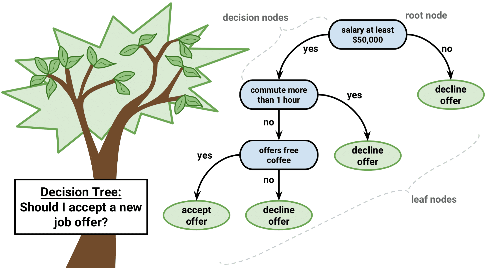
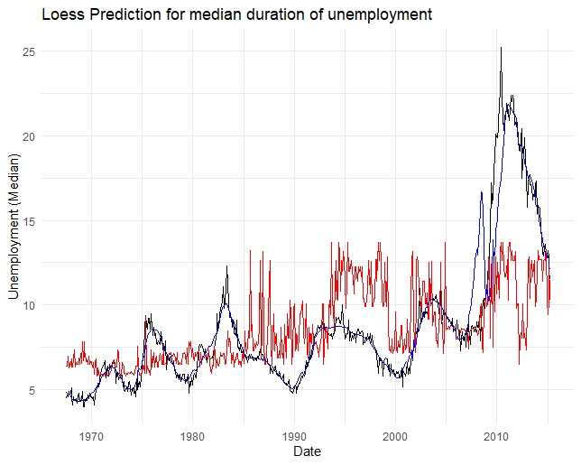

# 1. Fitting a linear regression model in R.

Let's take a look at the dataset called "Real_estate.csv". This data set is originally downloaded from [here](https://www.kaggle.com/quantbruce/real-estate-price-prediction) 

Let's first load the dataset in R and use `glimpse` to get a glimpse of your data.

```{r message=F}
library(tidyverse)
Housing <- read_csv("data/Real_estate.csv")
glimpse(Housing)
```

Below is the detailed information for each column:

Column  | Description
------------- | -------------
No  | Row number
transaction_date  | Transaction date
house age| House age
distance_MRT_stataion|Distance to the nearest MRT station in meters
stores| Number of convenience stores
latitude| latitude
longitude|longitude
pricepersqmeter|house price in U.S. dollars per sq.m


Let's explore if we can use linear regression models to better understand housing price. Housing prices usually depend on various of factors such as the number of bedrooms, size and so on. Now we consider housing price depends linearly on house age and distance to the nearest MRT station in meters. 
$$Price=\beta_{0}+\beta_{1}*age+\beta_{2}*distance$$

We need to use the built-in `lm()` function here to establish the model. Here we name the output model1. The response variable (price) is to the left of `~`, and all the explanatory variables are to the right. The `+` symbol here connect two explanatory variables. Execute the scripts below. 


```{r  eval=F}

model1 <- lm(pricepersqmeter  ~ house_age + distance_MRT_station, data = Housing)

```

## Question 1 (2 points)
What is the data type for `model1`? Vector, matrix, data frame or list?
Answer: list

To check out the results of the linear model above, we can use the `summary ` function:

```{r eval=F}
summary(model1)
```

The summary functions returns coefficients, residuals, std.errors etc. R-squared value will be displayed at the bottom of the summary. Note for a linear regression, R-squared is a goodness-of-fit measure for linear regression models. R-squared value is between 0-1. The value represents the percentage of the response variable variation that a linear model explains.

Alternatively, we can use the `tidy()`function in the `broom` package to get a pretty neat dataframe of the results:

```{r eval=F}
library(broom)
tidy(model1)
```

The fitted model is as follows:

$$Price=5139.72-23.80*age-0.74*distance$$


## Question 2 (3 points)
What is the R-squared value for model1?

Answer: 0.49

Let's try to fit another linear regression model using three columns: age, distance to MRT and stores. We can use `lm` in a pipes workflow too.

The codes below 

1) clean up the table: drop unnecessary columns (you will end up with only 4 columns: price, stores, distance_MRT_stataion and age.); 

2) establish a linear model where response variable is price (to the left of `~`), and the explanatory variable will be all the columns except price (`.`to the right of `~` will take all the columns but price as explanatory variable). `data=.` indicates it will take the output from the `select` function as the dataset;

3) The output of this linear regression model will be stored in `model2`. 

```{r eval=F}
model2 <- Housing %>%
  select(-No, -transaction_date,-latitude,-longitude) %>%
  lm(pricepersqmeter ~ ., data = .) 
```

Use `summary` function to examine the results of model2. 

## Question 3 (5 points)
What is the R-squared value for the model2?Based on R-squared value which model performs better explaining housing price? Model1 or model2? 

Answer: 0.54. Model2 performs better


How about model diagnostics?


Note linear regression is a parametric model. There are a few key assumptions required especially:

1) Normality: For any fixed value of X, Y is normally distributed. Check the Q-Q plot. A Q-Q plot is a scatterplot created by two sets of quantiles against one another. If normality assumption is met, we should see the points form a straight line. If you found concave, the data is skewed to right. Otherwise, convex means the data is skewed to the left. 

2) Homoscedasticity: The variance of residual is the same for any value of explanatory variables.

3) Linearity: The relationship between explanatory variables and the mean of response variable should be linear.

4) Independence: all the rows/observations are independent from each other.

Let's take a close look at model2. We can use `autplot` to quickly access the model's performance in graphs. Note you have to install and load the package first. Execute the commands below. 


```{r eval=F}
library(ggfortify)
autoplot(model2, which = 1:6) + theme_minimal()
```

Alternatively, the `gvlma` function in the `gvlma` pakcage will test all the assumptions for linear models at once in a more efficient way. The testing results will be aviable at the bottom, Note you have to install and load the package first. Execute the commands below. 


```{r eval=F}
library(gvlma)
gvmodel <- gvlma(model2)
summary(gvmodel)
```

 

                       
Global Stat: if our model is a linear combination of explanatory variables.         

Skewness: test residuals's normality 

Kurtosis: test kurtosis of residuals relative to a normal distribution

Link Function: whether response variable truly continuous, or categorical. If not accepted, alternative form of model is expected.

Heteroscedasticity: if variance of your residuals is relatively constant.


Based on our results, it seems that the only assumption is accepted is homoscedasity. Our regression coefficients produced by model2 are biased and the estimates are not reliable. 


Let's take a look at the distribution of the housing price:

```{r eval=F}
ggplot(Housing) +
  geom_density(aes(pricepersqmeter))
```

The data is not normally distributed. So we can fix it by modeling the log of price. 
```{r eval=F} 
model_log <- Housing %>%
  select(-No, -transaction_date,-latitude,-longitude) %>% 
    lm(log(pricepersqmeter) ~ ., data = .)
```

Here we got the R-squared:  0.6337. It seems that we get a better model. 

# 2. Data dimensionality reduction 

As we mentioned at the beginning of the semester, we introduced 4 Vs for big urban data: Volume, Variety, Velocity and veracity. For example, it is very common to see a large dataset over 100,000 row. If you go [here](https://data.cityofchicago.org/Transportatio) to check out the traffic crashes data in Chicago you will end up with a large table with over 500k rows and 49 columns. If we want to model or predict where or when the next crash will occur, it is necessary for us to reduce the data dimensionality, since high dimensionality makes calculations extremely difficult. At the same time, we can easily find multicolinearity exists between variables.The multicolinearity will reduce the precision of the estimated coefficient, and you might not be able to use p-values to identify if a statistical significance is found. 

To fix the data dimensionality issue, usually we have two options:

- Only keeping the most relevant variables from the original dataset, such as correlation filter. 
- Calculating a smaller set of new variables, each being a combination of the input variables, ideally it will preserve the same information as the raw variables, such as principal  component analysis (PCA).

## 2.1 Correlation filter

If any of the explanatory variables are highly correlated, that indicates that they have similar trend and will carry similar information toward the response variable. We need to calculate the correlation between each pair of the independent variables. Please note the correlation is usually between -1 to 1, where -1 indicates extreme negative correlation, and 1 indicates extreme positive correlation. 

We can use the `cor` function to calculate the correlation for each pair of the independent variables, and use the `findCorrelation` from the `caret` package to determine the highly correlated variable. Please note in general we need to seriously consider the variables if their correlation greater than 0.6. So the script below first calculate the correlation and then drop any variables with correlation larger than 0.6. Please note here we continue to use the housing dataset when introducing linear models in session 1. So the variable need to be dropped is number of stores since it is highly correlated with other variables. 

```{r eval=F}
library(caret)
Housing_explanatory <- Housing[,c(3,4,5)]
mtx <- cor(Housing_explanatory)
drop <- findCorrelation(mtx, cutoff = .6)
drop = names(Housing_explanatory)[drop]
```

After we drop the highly correlated variable, we can move to linear regression using only `house_age` and `distance_MRT_station` to model price (same as model1 above), which is more robust and reliable since the variables are note selected subjectively. 

## 2.2 Principal  component analysis (PCA)

PCA will help us to reduce the data dimensionality by creating a new set of variables/columns based on different combinations of the original **indepedent variables**. The newly extracted variables are called Principal Components. Please note PCA give you a *linear* combination of the original values.PCA is widely used to reduce the data dimensionality and make analyzing data much easier and faster especially for machine learning algorithms. Of course though we reduce the number of variables for the data, we preserve as much information as possible compared with the original dataset. It is often used as a pre-processing when working with large datasets with machine learning algorithms. Feel free to check out articles [here](http://ijtte.com/uploads/2018-06-25/6d5dccba-64d1-8fbaijtte.2018.8(3)02.pdf) and [here](https://reader.elsevier.com/reader/sd/pii/S0264275118307261?token=D6402466C669B8D10F2E0729F463985337DEC37BE840490861A1388ADF8BFB6B848ADF9F32B5B1E3CE170E074AB0D298&originRegion=us-east-1&originCreation=20210928221542) 

```{r eval=F}
library(factoextra) # You need this package to visualize the output of PCA
# Apply pca function over the data
pca_result <- prcomp(Housing_explanatory, scale = TRUE)
# View the results
summary(pca_result)

fviz_eig(pca_result) # check out the scree plot
fviz_pca_biplot(pca_result, repel = TRUE )# check out the biplot which is a overlay of a loading plot and a score plot
```

Based on the scree plot and biplot, we can see that PCA1 explains 53.4% of the variance of the original data, and PCA2 explains extra 33.5% of the variance. So we can use both PCA1 and PCA2 for further analysis with lower data dimensionality. 

When reading the Biplot,the angles or arrows between the vectors tell us how variables correlate with one another.

- When a small angle is found between two variables: the two variables are positively correlated. 
- when a nearly 90° is found between two variables: the variables are not likely to be correlated. For example, house_age and distance_MRT_station.
- When a large angle (close to 180°) is found, they are negative correlated. Example: distance_MRT_station and stores.

## 2.3 Principal  component regression (PCR)

PCR is a regression model which is calculated based on PCA. The basic logic is to use the calculated principal component as predictors in a linear regression model. The `pcr` function from the `pls` package can help you easily perform both dimensionality reduction as well as fitting a linear model with a smaller set of variables. We will now try to model house price using the `Housing` dataset we loaded in task 1. We use the first two components for the linear regression based on the results in session 2.2 


```{r eval=F}
library(caTools)
library(pls)
# Select useful columns
H <- Housing[,c(3,4,5,8)]
# Split data into training and testing by 7:3
sample <- sample.split(H$pricepersqmeter,SplitRatio=0.7)

# Subset out dataset based on this logical variable. 

train <- subset(H,sample==T)
test <- subset(H,sample==F)
# Apply PCR model 
pcr_model <- pcr(log(pricepersqmeter)~., data = train,scale =TRUE, validation = "CV")
# Predict testing data based on the pcr model with first 2 components. 
pcr_pred <- predict(pcr_model, test, ncomp = 2)

# Calculate average of the mean square error. 
sqrt(mean((pcr_pred - test$pricepersqmeter)^2))

# Calculate R2 value based on the predicted value and true value

R2(pcr_pred,test$pricepersqmeter)

# Plot out the scatter plot between predicted value and measured value
predplot(pcr_model)
```

The average of the mean square error using the PCR model is $4174.99 with R2 of 0.52. Please note the final number you get might slightly different than mine since we use subset the training dataset randomly each time. 

# 3. Fit a regression tree model in R
Decision trees (non-parametric, no assumptions needed!) are widely applied in data science and data mining to predict the value of a target variable based on the input variables. Regression tree is one of the variety of decision tree that the target variable can take continuous values.  

   

As the figure above, we can use a tree-based structure to decide if I should accept a new job offer. I have a few concerns from most important to least important: salary, commute time, and free coffee. 

1) First of all, if they pay me less than `$50,000`, I will definitely decline the offer; 

2) If they pay me above `$50,000`, I still need to consider the commute time. If it is more than 1 hour, I will not accept the offer. 

3) Beside all the two factors above, I will decline the offer if they do not provide free coffee everyday. 

Based on the "job offer" example above, the response variable is "accept/decline the offer", and the explanatory variables are: salary, commute time, and free coffee. My final decisions: whether I will accept or decline the offer is called leaf node in decision tree. Factors I concerned about e.g. salary> 50000 or not is called decision node. Here salary is the most important factor, so it is also the root node in my decision tree. 

Same for regression trees, we can use several explanatory variables to model a response variable. 


In decision trees, we start at the root node of the tree, which is usually the complete dataset. Then, we divide the dataset into two different subsets by a certain explanatory variable to make decision, and divide the data again based on the same or another explanatory variable for prediction until we reach the leaf node, or so-called terminal node (we cannot divide the dataset anymore). A leaf node represents a final decision/prediction. The topmost decision node in a tree which corresponds to the best predictor called root node. We call the conditions as decision nodes. Typically, the trees are drawn upside down, in the sense that the leaves are at the bottom of the tree. Decision trees are visually straightforward, and do not require much data pre-processing.

Let's try to fit a regression tree model using three columns: age, distance to MRT, and stores in the Housing dataset. 

The codes below 

1) clean up the table: drop unnecessary columns (you will end up with only 4 columns: price, stores, distance_MRT_stataion, and age). 

2) establish a regression tree model using `rpart` function, where response (target) variable is price, and the explanatory variable will be all the columns except price. The grammar is similar with the linear regression model elaborated before.

3) The output of this regression tree will be stored in `rpart_model`. 


```{r eval=F}
rpart_model <- Housing %>%
  select(-No, -transaction_date,-latitude,-longitude) %>% rpart(pricepersqmeter~., data=.)
rpart_model
```

It returns you some texts as results showing how does it predict price. To visualize this regression tree, the codes below are applied:

```{r eval=F}
windows.options(width=10, height=10)
plot(rpart_model,uniform=T)
text(rpart_model,digits=6,cex=0.75)
```

Note: `windows.options` is used to display the entire tree better; in `plot` function, `uniform` option is used to equalize the length of the branches so that the entire tree looks better; in `text` function, `digits` option is used to set how many digits to display in the leaf node; `cex` option is used to adjust the font size of the label. You can find more options for these two functions by calling the help document.

## Question 4 (5 points) 
How many root node(s) and leaf node(s) are there in the regression tree?

Answer: 1 root node and 7 leaf nodes

To interpret the tree: In general, for a given value for an explanatory variable, if the decision node is true, go to the left of the node; otherwise, go to the right side of the node when the decision node is false. 

Refer to the regression tree you just created, this tree represents a series of splits starting at the top of the tree. The top split assigns observations if for any given record, the distance is greater or equal to 826.8, go to the left branch. Then if the distance is even greater than 4007, we will decide the house price is 1757.45 USD/sq.m.

Let's go back to the top of the figure, if for any given record, distance is less than 826.8, we go to right branch to check out house age. If for this record, the house age is less than 11.7, we make a prediction that the mean unit price for these houses is 5382.88 USD/sq.m.

## Question 5 (5 points) 
How would you interpret the result that has a leaf node of 3994.39 USD/sq.m. based on the regression tree you just created?

Answer: the prediction is 3994.39 USD/sq.m when distance to the MTR station is less than 826.8, house age is greater or equal to 11.7, and distance should be greater than 331.7. 

### Tree Pruning

One problem of this regression tree is overfitting that the subset of data corresponding to a leaf node is very small, which might lead to inaccurate predictions. Therefore, to avoid the overfitting problem, we use tree pruning which essentially removes branches that do not make a significant impact on your error rate. The codes below are applied. DO NOT EXECUTE incomplete scripts!

```{r eval=F}
rpart_model2 <- prune(rpart_model,cp=?)
plot(rpart_model2,uniform=T)
text(rpart_model2,digits=6,cex=0.75)
```

*Caution here: we still need to find a cp value to process tree pruning!*

### Tree Validating:


The complexity parameter (cp) is used to control the size of the decision tree and to select the optimal tree size. We usually use `printcp` and/or `plotcp` to find the optimal value of the cp, which will be used to prune decision tree in the previous step.

```{r eval=F}
printcp(rpart_model)
plotcp(rpart_model)
```

From `printcp` function, we can see the more splits, the lower `xerror`, which stands for cross-validation error. Our original tree has 7 leaf nodes (a tree size of 7), and this tree does give us the lowest error. According to the plot obtained from `plotcp`, cutting the tree size from 7 to 5 does not add too much error, thus, a cp value of 0.022 could be a good option to reduce the complexity of the regression tree. Use cp=0.022 to complete the code chunk under tree pruning above.

## Question 6 (5 points) 
Based on the pruned regression tree, what are the conditions of the house that has a predicted unit price of 4745.89 USD/sq.m?

```{r eval=F}
rpart_model2 <- prune(rpart_model,cp=0.022)
plot(rpart_model2,uniform=T)
text(rpart_model2,digits=6,cex=0.75)
```

Answer: price is 4745.89 USD/sq.m when the distance to MRT is less than 826.8, and the house age is greater than 11.7, at the same time, the distance to MRT is even less than 331.7. 


Apparently, decision tree output is very easy to understand even for people with non-statistical background. However, it has very limited power predicitng continuous numerical variables. This exercise just tends to introduce the basic concepts.  

# 4. Fit a local regression in R

Different than linear regression, local Regression (`loess` function in R) is a non-parametric (no assumptions are needed!) approach that fits regressions at local level. In other words, a least squares regression is performed for localized subsets, and it allows you to decide the size of these subsets. In this case, local regression is also called smoothing, since it replaces data points with their predicted values which are computed using their nearby points as subsets.

Local regression is the most commonly used to for time series analysis because of its flexibility. Let's try to establish a local regression model in R using the `loess` function. The dataset we need is called `economics` from the `ggplot2` package. Note if you already have `tidyverse` loaded, you are good to go without calling ggplot2 library. Examine the columns via the help page. 

```{r eval=F}
data(economics)
?economics
```


This time series data is the monthly records of typical economic variables from 1967-2015 in US. Is there any relationship between median duration of unemployment (response variable) and personal saving rate (explanatory variable) throughout time? We need `loess` function to generate the model. 

Similar to the structure for `lm` function, within `loess` we use `~` to connect x and y. There is one more parameter we have to specify: how large is "local" here in our model? We can set up a value for `span` to determine the proportion of the data points among all the observations to be treated as local points. For example, span=0.1 indicates 10% of the data can be used as the nearest neighbors to a certain data point on x. 


Execute the commands below.


```{r eval=F}
loess_savings <- loess(uempmed ~ psavert, data=economics, span=0.10) 
loess_savings
```

Based on the result, we got 3.547 for the residual standard error. Note the residual standard error is the square root of the residual sum of squares divided by the residual degrees of freedom. Smaller redidual standard error indicates a better fit. 

Apparently span is betwen 0-1. What happened if we set span too small or too large? 

"Using an appropriate span is important: having a very small span causes the
regression function to be simply predict the target variable at that data point. Using
a large span causes oversmoothing, where the neighborhood for local fitting is so
large that we end up averaging out the variances in the data points." - From Beginning Data Science with R. Click [*here*](https://www.springer.com/gp/book/9783319120652) for more information.

## Question 7 (10 points)

Generate another local regression model for median duration of unemployment (response variable), where the explanatory variable is pce: personal consumption expenditures. Note you need to set span=0.1 to keep the consistency with our model above. Name your model as loess_pce. Based on residual standard error, which model performans better predicting median duration of unemployment ?

```{r eval=F}
# Finish the command below and answer the question
loess_pce <- loess(uempmed ~ pce, data=economics, span=0.10) 
loess_pce
```

Answer: The residual standard error is 1.326. loess_pce performs better. 

Let's create a line chart to check out the results. 1. we need a line represents the actual median duration of unemployment from 1967-2015. 2. We can add predictions based on our model as an extra line in the same chart. Let's use the loess_savings model as example. 


```{r eval=F}
# To obtain predicted values 
pred_savings <- predict(loess_savings) 
# Generate line chart 
# we set x=date within ggplot as a global setting, 
# so all the following geom_lines will use date as 
# x-axis unless we set something else. 
# Within each geom_line function, we just need to specify y differently.
# One is the actual value, the other is the predicted value.  
ggplot(economics, aes(x=date))+
    geom_line(aes(y=uempmed), color="Black")+ 
    geom_line(aes(y=pred_savings), color="Red")+
    labs(title="Loess Prediction for median duration of unemployment ", 
         x="Date", y="Unemployment (Median)")+ theme_minimal()

```

How about the model you created in previous question? Note you need to get the predicted value first, then you can generate a plot. 

## Question 8 (10 points)
Add the predicted value based on loess_pce as a line to the figure above, where you can set a different color other than red or black. Add proper title and labels. Explort the graph and turn it in as your answer.  


```{r eval=F}
# To obtain predicted values based on loess_pce
pred_pce <- predict(loess_pce) 
# Modify the commands below
  
ggplot(economics, aes(x=date))+
    geom_line(aes(y=uempmed), color="Black")+ 
    geom_line(aes(y=pred_savings), color="Red")+
    geom_line(aes(y=pred_pce), color="Blue")+
    labs(title="Loess Prediction for median duration of unemployment ", 
         x="Date", y="Unemployment (Median)")+ theme_minimal()

```


 


## Question 9 (5 points)
Based on the line chart you created above, which model performans better predicting median duration of unemployment ?
 
Answer: loess_pce performs better. Since the predicted value are closer to the true value compared with loess_savings. 
